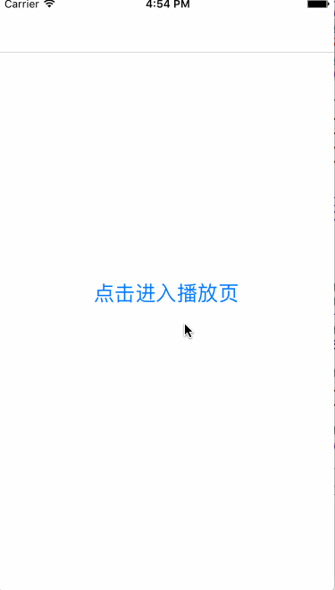

# MyVideoPlayer
基于AVPlayer的简单视频播放器，swift3

# 图示

# 用法
        self.player = MyPlayer(frame: CGRect.zero, urlString: "http://baobab.wdjcdn.com/1455782903700jy.mp4", title: "测试")
        self.player.contrainerViewController = self
        self.view.addSubview(self.player)
        
        
# 提醒
目前只完成简单功能

        
        
